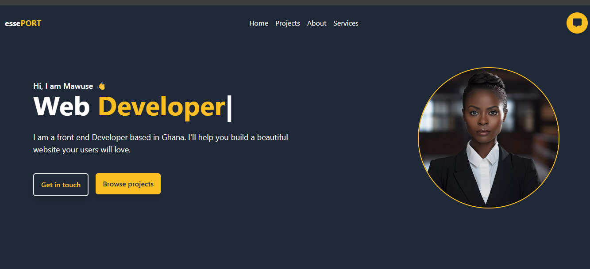
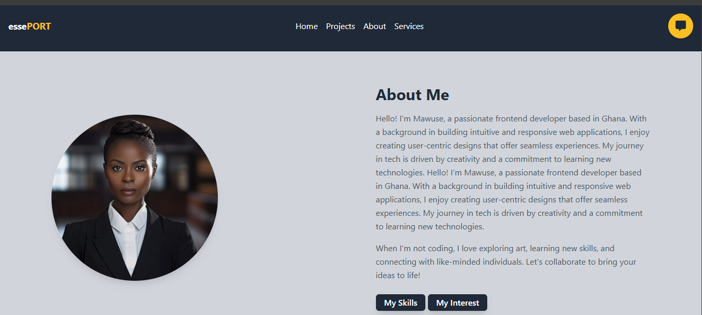
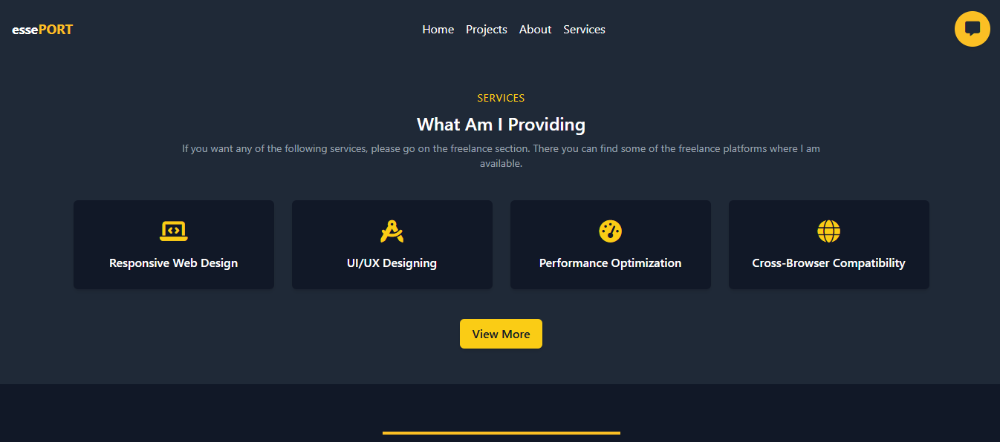
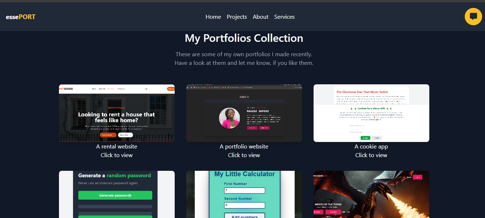
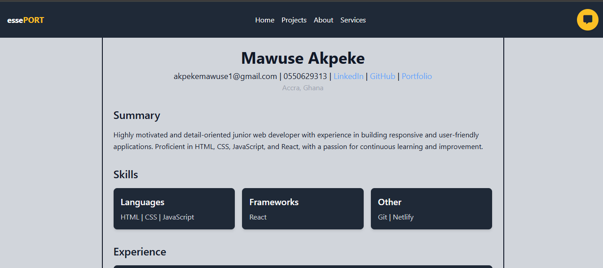
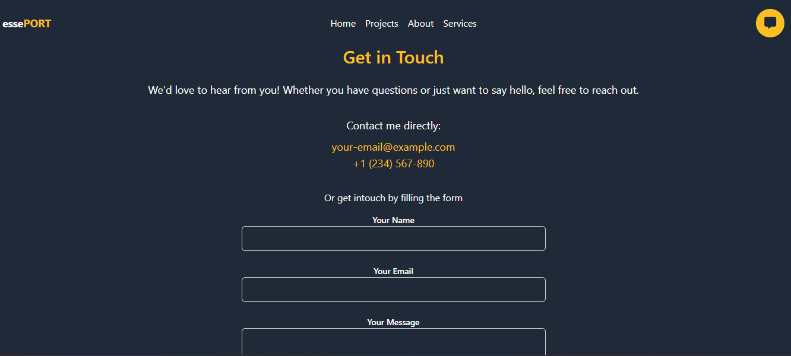

# 🌟 Portfolio Website  
Welcome to my personal portfolio website! This project showcases my skills, interests, and the projects I've worked on as a frontend developer.

### Project Description
This portfolio is designed to reflect my personality and technical skills. It includes detailed sections about me, my interests, and my expertise, along with an intuitive and responsive design to ensure a seamless browsing experience on all devices.

---

## ✨ Features  

- 🌐 **About Section**: Learn about my journey, background, and hobbies. 
- 💼 **Skill Section**: Highlights the technical tools and technologies I work with.
- 🛠️ **Interest Section**: A deeper dive into what drives my passion for development and collaboration..  
- 📬 **Interactive Section**: Dynamic content with smooth transitions and hover effects for better engagement.
- 📱 **Dynamic Animation**: Animated text showcasing key roles using Typed.js. 
- 📱 **Responsive Layout**: Optimized for desktop, tablet, and mobile views.

---
## 🖥️ Technologies Used  

- 🏗️ **HTML**: For structuring the content.  
- ✨ **JavaScript**: For adding interactivity to the website.  
- 🚀  **Typed.js and Css**: For creating dynamic text animations.
- ✨  **Tailwind Css**: For styling and responsive design.

---

### Getting Started
Prerequisites;
To run this project locally, ensure you have:
A modern web browser (Google Chrome, Firefox, etc.).
A text editor (e.g., Visual Studio Code) for making edits if needed.

### Installation
### 1. Clone the Repository  
```bash  
git clone https://github.com/mawuse-tech/My-personal-portfolio.git  
```
### 2. Navigate to the Project Directory  
```bash  
cd portfolio-website  
```
### 3. Open the Website in Your Browser  
- Locate the `index.html` file in the project directory.  
- Right-click on the file and select **Open With** > **Your Preferred Browser** (e.g., Chrome, Firefox, Edge).  
- Alternatively, drag and drop the `index.html` file directly into your browser window.  

## 📸 Screenshots  

Here's a preview of the website!  

- **Homepage** 
  

- **About me** 
 

- **Services page** 
  

- **Portfolio page** 
 

- **Resume Page** 
 

- **Contact Page** 
 

- **Contact** :
Want to work together or have feedback? Feel free to reach out!

Email: akpekemawuse1@gmail.com
GitHub: mawuse-tech
LinkedIn: https://www.linkedin.com/in/mawuse-akpeke-aa28a8245/


  


