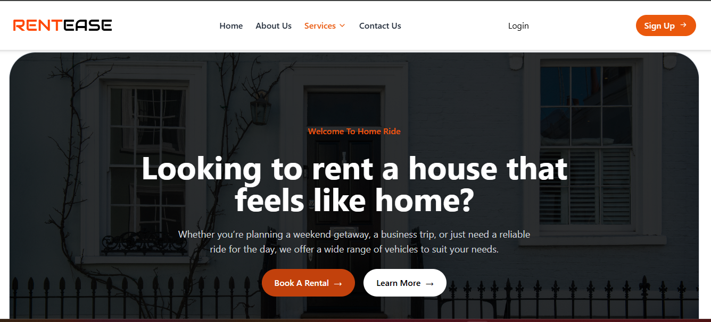

MAWUSE'S PORTFOLIO WEBSITE

Welcome to my personal portfolio website! This project showcases my skills, interests, and the projects I've worked on as a frontend developer.

ABOUT THE PROJECT
This portfolio is designed to reflect my personality and technical skills. It includes detailed sections about me, my interests, and my expertise, along with an intuitive and responsive design to ensure a seamless browsing experience on all devices.

FEATURES
About Section: Learn about my journey, background, and hobbies.

Skills Section: Highlights the technical tools and technologies I work with.

Interests Section: A deeper dive into what drives my passion for development and collaboration.

Interactive Design: Dynamic content with smooth transitions and hover effects for better engagement.

Dynamic Text Animation: Animated text showcasing key roles using Typed.js.

Responsive Layout: Optimized for desktop, tablet, and mobile views.

TECHNOLOGIES USED
HTML: For the structure of the website.

Tailwind CSS: For styling and responsive design.

JavaScript: For dynamic and interactive features.

Typed.js and css: For creating dynamic text animations.

GETTING STARTED
Prerequisites;

To run this project locally, ensure you have:

A modern web browser (Google Chrome, Firefox, etc.).
A text editor (e.g., Visual Studio Code) for making edits if needed.

INSTALLATION
1. Clone the repository:
   git clone https://github.com/yourusername/portfolio-website.git

2. Navigate to the project directory:
   cd portfolio-website

3.  Locate the `index.html` file in the project directory.  
- Right-click on the file and select Open With > **Your Preferred Browser** (e.g., Chrome, Firefox, Edge).  
- Alternatively, drag and drop the `index.html` file directly into your browser window. 

 📸 SCREENSHOTS 

Here's a preview of the website!  

- Homepage 
  

- About me 
 

- Services page
  

- Portfolio page
 

- Resume page
 

- contact page
 

Contact
Want to work together or have feedback? Feel free to reach out!

Email: mawuse@example.com
GitHub: MawuseGitHub
LinkedIn: MawuseLinkedIn


  


### 1. Clone the Repository  
```bash  
git clone https://github.com/your-username/portfolio-website.git  
```
### 2. Navigate to the Project Directory  
```bash  
cd portfolio-website  
```
### 3. Open the Website in Your Browser  
- Locate the `index.html` file in the project directory.  
- Right-click on the file and select **Open With** > **Your Preferred Browser** (e.g., Chrome, Firefox, Edge).  
- Alternatively, drag and drop the `index.html` file directly into your browser window.  


## 📸 Screenshots  

Here's a preview of the website!  

- **Homepage**  
  

- **Projects Page**  
  

- **Contact Section**  
  